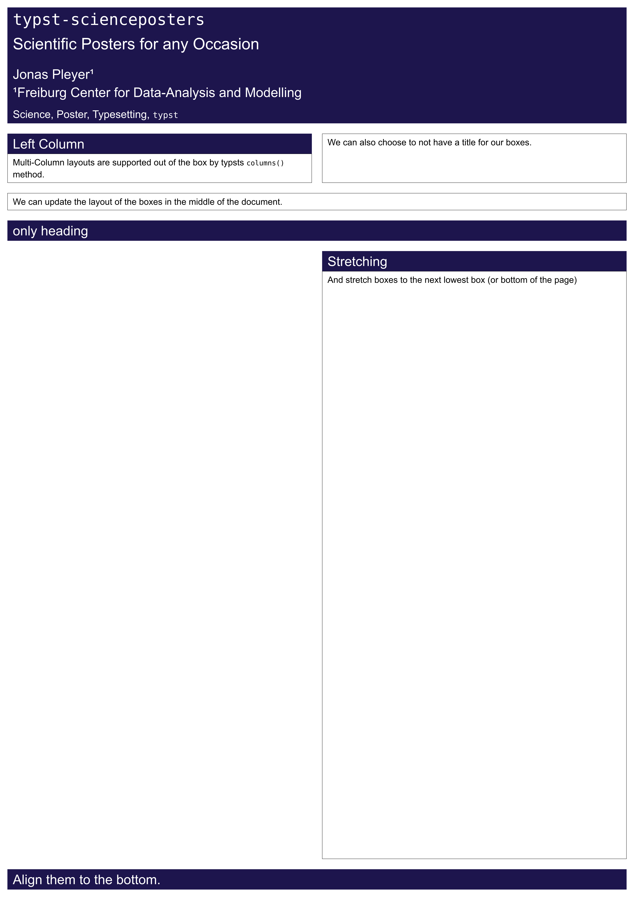

# Overview
`typst-posters` allows to create simple but elegant posters.
It does not make any assumptions about layout (eg. 2/3 column), size of the poster (eg. a0, a1) or orientation.
Its main functionality is provided by a handful of functions that create [boxes](documentation/boxes) with optional titles.
There are specific functions for defining title boxes and bottom boxes.
It provides predefined [themes](documentation/themes) which can be adjusted to customize the design of the boxes.

To find out what you can do today with `typst-posters`, have a look at the [showcased examples](showcase).

## Example
We begin by importing the `typst-posters` package
```
#import "typst-posters/lib.typ": *
```
Next, we specify some general settings formatting settings.
```
#set page("a0", margin: 1cm)
#set_layout(layout_a0)
#set text(font: "Arial", size: layout_a0.at("body_size"))
```
After that we choose a predefined theme.
```
#set_theme(uni_fr)
```
We can adjust any property of the theme via the `update_theme` method of the [themes](documentation/themes) module.
The poster consists of multiple boxes which can be adjusted by specifying [column layouts](https://typst.app/docs/reference/layout/columns/).
`typst-posters` provideds some predefiend methods for creating a title-box, regular column-boxes in between, a bottom box and bibliography to finish it of.
```
#title_box(
    [`typst-posters`],
    subtitle: [Scientific Posters for any Occasion],
    authors: [Jonas Pleyer#super("1")],
    institutes: [#super("1")Freiburg Center for Data-Analysis and Modelling],
    keywords: [Science, Poster, Typesetting, `typst`],
)

#columns(2, [
    #column_box(
        heading: [Left Column],
    )[
        Multi-Column layouts are supported out of the box by typsts `columns()` method.
    ]

    #colbreak()

    #column_box()[
        We can also choose to not have a title for our boxes.
    ]
])

#column_box()[
    We can update the layout of the boxes in the middle of the document.
]

#_common_box(heading: [only heading])

#columns(2, [
    #colbreak()
    #column_box(
        heading: [Stretching],
        stretch_to_bottom: true
    )[
        And stretch boxes to the next lowest box (or bottom of the page)
    ]
])

#bottom_box()[
    Align them to the bottom.
]

```

## Final Result
<div class="showcase-single" style="text-align: center; padding: 1em;">
<a href="examples/getting_started/main.pdf"></a>
</div>
